# **Cholesky Factorization**

## **Index**
1. [Introduction](#introduction)
    - [Positive semidefinite matrices](#positive-semidefinite-matrices)
2. [The Cholesky algorithm](#the-cholesky-algorithm)
    - [The Cholesky–Banachiewicz and Cholesky–Crout algorithms](#the-cholesky–banachiewicz-and-cholesky–crout-algorithms)
    - [The Computation by Diagonal Algorithm](#the-computation-by-diagonal-algorithm)
3. [Implementation Info and comparison with other methods](#implementation-info-and-comparison-with-other-methods)
4. [Results](#results)
5. [Installation and env preparation](#installation-and-virtual-environment-preparation)
6. [Execution Guide](#execution-guide)


<hr>

## **Introduction**
In linear algebra, the **Cholesky decomposition** or **Cholesky factorization** is a decomposition of a ***Hermitian, positive-definite matrix*** into the product of a lower triangular matrix and its conjugate transpose, which is useful for efficient numerical solutions, e.g., Monte Carlo simulations and **Linear least squares** problems.

The Cholesky decomposition of a Hermitian positive-definite matrix $A$, is a decomposition of the form

$A = L L^∗$ ,

where $L$ is a **lower triangular matrix** with real and positive diagonal entries, and $L^*$ denotes the **conjugate transpose** of $L$. Every Hermitian positive-definite matrix (and thus also every real-valued symmetric positive-definite matrix) has a *unique Cholesky decomposition*.

When $A$ is a real matrix (hence symmetric positive-definite), the factorization may be written

$A = L L^T$,

where $L$ is a real lower triangular matrix with positive diagonal entries.
<br>

## **Positive semidefinite matrices**
If a Hermitian matrix $A$ is only positive semidefinite, instead of positive definite, then it still has a decomposition of the form $A = LL^*$ where the diagonal entries of L are allowed to be zero. The decomposition need not be unique, for example:

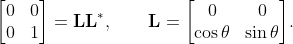

However, if the rank of $A$ is $r$, then there is a unique lower triangular $L$ with exactly $r$ positive diagonal elements and $n−r$ columns containing all zeroes.

<hr>

# **The Cholesky algorithm**

The Cholesky algorithm, used to calculate the decomposition matrix L, is a modified version of Gaussian elimination.

The recursive algorithm starts with i := 1 and

$A(1) := A$.

At step i, the matrix $A^{(i)}$ has the following form:

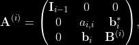

where $I_{i−1}$ denotes the identity matrix of dimension i − 1.

If we now define the matrix $L_i$ by

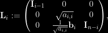

(note that $a_{i,i}$ > 0 since $A^{(i)}$ is positive definite), then we can write $A^{(i)}$  as

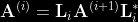

where

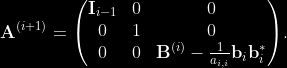

Note that $b_i$ $b^*_i$ is an outer product, therefore this algorithm is called the outer-product version in (Golub & Van Loan).

We repeat this for i from 1 to n. After n steps, we get $A^{(n+1)}$  = $I$. Hence, the lower triangular matrix $L$ we are looking for is calculated as

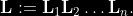

<br>

## **The Cholesky–Banachiewicz and Cholesky–Crout algorithms**
If we write out the equation

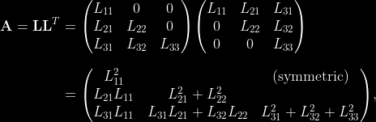

we obtain the following:

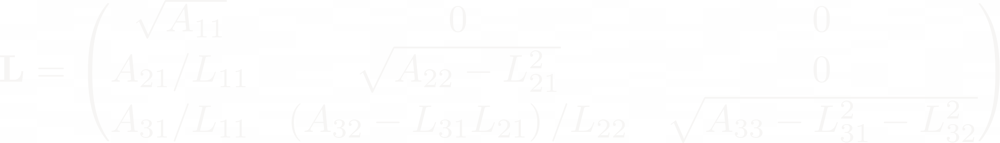

and therefore the following formulas for the entries of L:

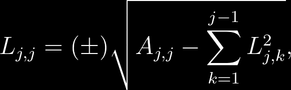

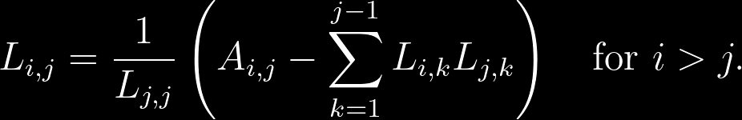

For complex and real matrices, inconsequential arbitrary sign changes of diagonal and associated off-diagonal elements are allowed. The expression under the **square root** is always positive if A is real and positive-definite.

For complex Hermitian matrix, the following formula applies:

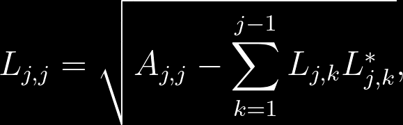


So we can compute the (i, j) entry if we know the entries to the left and above. The computation is usually arranged in either of the following orders: 

- ### **Computation proceeding row by row: Cholesky–Banachiewicz algorithm** <br>
    It starts from the upper left corner of the matrix L and proceeds to calculate the matrix row by row. <br>
    fotina carina
- ### **Computation proceeding column by column: Cholesky–Crout algorithm** <br>
    It starts from the upper left corner of the matrix L and proceeds to calculate the matrix column by column. <br>
    fotina carina 

## **The Diagonal by Diagonal Computation Algorithm**
**We found that there exist another, funny and much difficult to implement, method to compute the Cholesky Factorization**. This was an idea of our Numerical Approximation course professor and consist in computing the factorization by proceeding in diagonal (antidiagonal to be precise). <br>
This method starts from the upper left corner of the matrix L and proceeds to calculate the matrix antidiagonal by antidiagonal (see the img below for more details).

fotina carina

<hr>

## **Implementation Info and comparison with other methods**
In order to demonstrate the speed of Cholesky Factorization over Gaussian Elimination we make a lot of test using a 5000 x 5000 matrix and log the execution time of the 2 method.

- **Cholesky Factorization time complexity**: $O(\dfrac{1}{3} n^3 + \dfrac{2}{3}n)$
- **Gaussian Elimination time complexity**: $O(n^3)$

The comparis was made using normal compilation and also compilation with ***JIT*** provided by ***Numba*** python package (see [Numba](https://numba.pydata.org/numba-doc/latest/user/jit.html)).

### **Directory content explaination**
The project is composed of 4 directory:
- `cholesky_factorization`: contains the `cholesky.py` file that contains the cholesky implementations with all 3 methods described before.
- `utils`: contains some python script used for 
    - generate random matrix which are solvable factorizable using cholesky
    - log execution time
    - test and validation of obtained results
- `gaussian_elimination`: contains `gaussian_elimination.py` script that implement gaussian elimination method.
- `linear_system_solver`: contains `linsys_solver.py` script that implement the resolution of linear system.

You can take the single script and refactor the code to use for any correlated implementation as you want. <br>
For any doubt, question or issue you can open an issue or post it on [Discussion](https://github.com/CristianCosci/Cholesky_Decomposition_python/discussions) tab.

<hr>

## **Results**
In this section there are the result obtained with random 5000 x 5000 matrix in order to compare **Gauss and Cholesky** methods. <br>
For each type of test we repeated it 3 times to obtain an avg value. <br>
The execution times are expressed in **milliseconds (ms)**.

### **Cholesky Factorization (no JIT)**

| Algorithm | Method  | Matrix Size | JIT | Execution Time #1 | Execution Time #2 | Execution Time #3 | AVG Execution Time | 
| --------- | ------- | ----------- | --- | ----------------- | ----------------- | ----------------- | ------------------ |
| Cholesky  | COLUMN  | 5000        | ❌  |   46000           | 45000             | 45000             | 45333.33           |
| Cholesky  | ROW     | 5000        | ❌  |   73000           | 71000             | 70000             | 71333.33           |
| Cholesky  | DIAGONAL| 5000        | ❌  |   48000           | 49000             | 48000             | 48333.33           |


### **Cholesky Factorization (JIT)**

| Algorithm | Method  | Matrix Size | JIT | Execution Time #1 | Execution Time #2 | Execution Time #3 | AVG Execution Time | 
| --------- | ------- | ----------- | --- | ----------------- | ----------------- | ----------------- | ------------------ |
| Cholesky  | COLUMN  | 5000        | ✅  |   23000           | 23000             | 23000             | 23000.00           |
| Cholesky  | ROW     | 5000        | ✅  |   43000           | 43000             | 42000             | 42666.66           |
| Cholesky  | DIAGONAL| 5000        | ✅  |   25000           | 26000             | 26000             | 25666.66           |


### **Gussian Elimination**

| Algorithm | Method  | Matrix Size | JIT | Execution Time #1 | Execution Time #2 | Execution Time #3 | AVG Execution Time | 
| --------- | ------- | ----------- | --- | ----------------- | ----------------- | ----------------- | ------------------ |
| Gauss     |         | 5000        | ❌  |   51000           | 50000             | 50000             | 50333.33           |


### **Cholesky (no JIT) vs Cholesky (JIT)**

| Algorithm | Method  | Matrix Size | AVG Execution Time (no JIT) | AVG Execution Time (JIT) | DIFF               |
| --------- | ------- | ----------- | --------------------------- | ------------------------ | ------------------ |
| Cholesky  | COLUMN  | 5000        | 45333.33                    | 23000.00                 | -22333.33 (49.26%) |
| Cholesky  | ROW     | 5000        | 71333.33                    | 42666.66                 | -28666.67 (40.18%) |
| Cholesky  | DIAGONAL| 5000        | 48333.33                    | 25666.66                 | -22666.67 (46.89%) |


### **Cholesky Factorization VS Gaussian Elimination**

| Cholesky Factorization Method | JIT | AVG Execution Time | Gaussian Elimination AVG Execution Time | DIFF               |
| ----------------------------- | --- | ------------------ | --------------------------------------- | ------------------ |
| COLUMN                        | ❌  | 45333.33           | 50333.33                                | -5000.00  (9.93%)  | 
| ROW                           | ❌  | 71333.33           | 50333.33                                | +21000.00 (41.72%) |
| DIAGONAL                      | ❌  | 48333.33           | 50333.33                                | -2000.00  (3.97%)  | 
| COLUMN                        | ✅  | 23000.00           | 50333.33                                | -27333.33 (54.30%) |
| ROW                           | ✅  | 42666.66           | 50333.33                                | -7666.66  (15.23%) | 
| DIAGONAL                      | ✅  | 25666.66           | 50333.33                                | -24666.67 (49.00%) |

<hr>

## **Installation and virtual environment preparation**
1. Create a dir and download the project inside.
2. Create a virtual env in that directory
    ```shell 
    virtualenv cholesky_env
    ```
3. Activate venv to install project requirements
    ```shell
    source cholesky_env/bin/activate
    ```
4. Move to project dir and Install requirements
    ```shell
    pip install -r requirements.txt
    ```
5. Now you are ready to execute and test the project.

<hr>

## **Execution Guide**
todo


<hr>


<hr>

#### **References**
- <https://en.wikipedia.org/wiki/Cholesky_decomposition>
