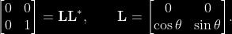

# **Cholesky Factorization**

## **Index**
1. [Introduction](#introduction)
2. [Positive semidefinite matrices](#positive-semidefinite-matrices)
3. [The Cholesky algorithm](#the-cholesky-algorithm)
4. [Installation and env preparation](#installation-and-virtual-environment-preparation)
5. [Execution Guide](#execution-guide)
6. [Results](#results)

<hr>

### **Introduction**
In linear algebra, the **Cholesky decomposition** or **Cholesky factorization** is a decomposition of a ***Hermitian, positive-definite matrix*** into the product of a lower triangular matrix and its conjugate transpose, which is useful for efficient numerical solutions, e.g., Monte Carlo simulations and **Linear least squares** problems.

The Cholesky decomposition of a Hermitian positive-definite matrix $A$, is a decomposition of the form

$A = L L^∗$ ,

where $L$ is a **lower triangular matrix** with real and positive diagonal entries, and $L^*$ denotes the **conjugate transpose** of $L$. Every Hermitian positive-definite matrix (and thus also every real-valued symmetric positive-definite matrix) has a *unique Cholesky decomposition* (citazione).

When $A$ is a real matrix (hence symmetric positive-definite), the factorization may be written

$A = L L^T$,

where $L$ is a real lower triangular matrix with positive diagonal entries.
<br>

## **Positive semidefinite matrices**
If a Hermitian matrix $A$ is only positive semidefinite, instead of positive definite, then it still has a decomposition of the form $A = LL^*$ where the diagonal entries of L are allowed to be zero. The decomposition need not be unique, for example:



$
{\displaystyle {\begin{bmatrix}0&0\\0&1\end{bmatrix}}=\mathbf {L} \mathbf {L} ^{*},\quad \quad \mathbf {L} ={\begin{bmatrix}0&0\\\cos \theta &\sin \theta \end{bmatrix}}.}
$

However, if the rank of $A$ is $r$, then there is a unique lower triangular $L$ with exactly $r$ positive diagonal elements and $n−r$ columns containing all zeroes.

<hr>

# **The Cholesky algorithm**

The Cholesky algorithm, used to calculate the decomposition matrix L, is a modified version of Gaussian elimination.

The recursive algorithm starts with i := 1 and

$A(1) := A$.

At step i, the matrix $A^{(i)}$ has the following form:

$
    \mathbf {A} ^{(i)}={\begin{pmatrix}\mathbf {I} _{i-1}&0&0\\0&a_{i,i}&\mathbf {b} _{i}^{*}\\0&\mathbf {b} _{i}&\mathbf {B} ^{(i)}\end{pmatrix}},
$

where $I_{i−1}$ denotes the identity matrix of dimension i − 1.

If we now define the matrix $L_i$ by

$
    \mathbf {L} _{i}:={\begin{pmatrix}\mathbf {I} _{i-1}&0&0\\0&{\sqrt {a_{i,i}}}&0\\0&{\frac {1}{\sqrt {a_{i,i}}}}\mathbf {b} _{i}&\mathbf {I} _{n-i}\end{pmatrix}},
$

(note that $a_{i,i}$ > 0 since $A^{(i)}$ is positive definite), then we can write $A^{(i)}$  as

$
    \mathbf {A} ^{(i)}=\mathbf {L} _{i}\mathbf {A} ^{(i+1)}\mathbf {L} _{i}^{*}
$

where

$
    \mathbf {A} ^{(i+1)}={\begin{pmatrix}\mathbf {I} _{i-1}&0&0\\0&1&0\\0&0&\mathbf {B} ^{(i)}-{\frac {1}{a_{i,i}}}\mathbf {b} _{i}\mathbf {b} _{i}^{*}\end{pmatrix}}.
$

Note that $b_i$ $b*_i$ is an outer product, therefore this algorithm is called the outer-product version in (Golub & Van Loan).

We repeat this for i from 1 to n. After n steps, we get $A^{(n+1)}$  = $I$. Hence, the lower triangular matrix $L$ we are looking for is calculated as

$
    \mathbf {L} :=\mathbf {L} _{1}\mathbf {L} _{2}\dots \mathbf {L} _{n}.
$


### **The Cholesky–Banachiewicz and Cholesky–Crout algorithms**
If we write out the equation

$
   {\displaystyle {\begin{aligned}\mathbf {A} =\mathbf {LL} ^{T}&={\begin{pmatrix}L_{11}&0&0\\L_{21}&L_{22}&0\\L_{31}&L_{32}&L_{33}\\\end{pmatrix}}{\begin{pmatrix}L_{11}&L_{21}&L_{31}\\0&L_{22}&L_{32}\\0&0&L_{33}\end{pmatrix}}\\[8pt]&={\begin{pmatrix}L_{11}^{2}&&({\text{symmetric}})\\L_{21}L_{11}&L_{21}^{2}+L_{22}^{2}&\\L_{31}L_{11}&L_{31}L_{21}+L_{32}L_{22}&L_{31}^{2}+L_{32}^{2}+L_{33}^{2}\end{pmatrix}},\end{aligned}}}
$

we obtain the following:

$
    {\displaystyle {\begin{aligned}\mathbf {L} ={\begin{pmatrix}{\sqrt {A_{11}}}&0&0\\A_{21}/L_{11}&{\sqrt {A_{22}-L_{21}^{2}}}&0\\A_{31}/L_{11}&\left(A_{32}-L_{31}L_{21}\right)/L_{22}&{\sqrt {A_{33}-L_{31}^{2}-L_{32}^{2}}}\end{pmatrix}}\end{aligned}}}
$

and therefore the following formulas for the entries of L:

$
    {\displaystyle L_{j,j}=(\pm ){\sqrt {A_{j,j}-\sum _{k=1}^{j-1}L_{j,k}^{2}}},}
$

$
    {\displaystyle L_{i,j}={\frac {1}{L_{j,j}}}\left(A_{i,j}-\sum _{k=1}^{j-1}L_{i,k}L_{j,k}\right)\quad {\text{for }}i>j.}
$

For complex and real matrices, inconsequential arbitrary sign changes of diagonal and associated off-diagonal elements are allowed. The expression under the **square root** is always positive if A is real and positive-definite.

For complex Hermitian matrix, the following formula applies:

$
    {\displaystyle L_{j,j}={\sqrt {A_{j,j}-\sum _{k=1}^{j-1}L_{j,k}L_{j,k}^{*}}},}
$

$
    {\displaystyle L_{i,j}={\frac {1}{L_{j,j}}}\left(A_{i,j}-\sum _{k=1}^{j-1}L_{i,k}L_{j,k}^{*}\right)\quad {\text{for }}i>j.}
$

So we can compute the (i, j) entry if we know the entries to the left and above. The computation is usually arranged in either of the following orders: 

cholesky diagonale TODO


## **Installation and virtual environment preparation**
1. Create a dir and download the project inside.
2. Create a virtual env in that directory
    ```shell 
    virtualenv cholesky_env
    ```
3. Activate venv to install project requirements
    ```shell
    source cholesky_env/bin/activate
    ```
4. Move to project dir and Install requirements
    ```shell
    pip install -r requirements.txt
    ```
5. Now you are ready to execute and test the project.

<hr>


## **Execution Guide**
todo


<hr>

## Results

I tempi di esecuzione sono espressi in **secondi (s)**.

### Cholesky Factorization (no JIT)

| Algorithm | Method  | Matrix Size | JIT | Execution Time #1 | Execution Time #2 | Execution Time #3 | AVG Execution Time | 
| --------- | ------- | ----------- | --- | ----------------- | ----------------- | ----------------- | ------------------ |
| Cholesky  | COLUMN  | 5000        | ❌  |   46000           | 45000             | 45000             | 45333.33           |
| Cholesky  | ROW     | 5000        | ❌  |   73000           | 71000             | 70000             | 71333.33           |
| Cholesky  | DIAGONAL| 5000        | ❌  |   48000           | 49000             | 48000             | 48333.33           |


### Cholesky Factorization (JIT)

| Algorithm | Method  | Matrix Size | JIT | Execution Time #1 | Execution Time #2 | Execution Time #3 | AVG Execution Time | 
| --------- | ------- | ----------- | --- | ----------------- | ----------------- | ----------------- | ------------------ |
| Cholesky  | COLUMN  | 5000        | ✅  |   23000           | 23000             | 23000             | 23000.00           |
| Cholesky  | ROW     | 5000        | ✅  |   43000           | 43000             | 42000             | 42666.66           |
| Cholesky  | DIAGONAL| 5000        | ✅  |   25000           | 26000             | 26000             | 25666.66           |


### Gussian Elimination

| Algorithm | Method  | Matrix Size | JIT | Execution Time #1 | Execution Time #2 | Execution Time #3 | AVG Execution Time | 
| --------- | ------- | ----------- | --- | ----------------- | ----------------- | ----------------- | ------------------ |
| Gauss     |         | 5000        | ❌  |   51000           | 50000             | 50000             | 50333.33           |


### Cholesky (no JIT) vs Cholesky (JIT)

| Algorithm | Method  | Matrix Size | AVG Execution Time (no JIT) | AVG Execution Time (JIT) | DIFF               |
| --------- | ------- | ----------- | --------------------------- | ------------------------ | ------------------ |
| Cholesky  | COLUMN  | 5000        | 45333.33                    | 23000.00                 | -22333.33 (49.26%) |
| Cholesky  | ROW     | 5000        | 71333.33                    | 42666.66                 | -28666.67 (40.18%) |
| Cholesky  | DIAGONAL| 5000        | 48333.33                    | 25666.66                 | -22666.67 (46.89%) |


### Cholesky Factorization VS Gaussian Elimination

| Cholesky Factorization Method | JIT | AVG Execution Time | Gaussian Elimination AVG Execution Time | DIFF               |
| ----------------------------- | --- | ------------------ | --------------------------------------- | ------------------ |
| COLUMN                        | ❌  | 45333.33           | 50333.33                                | -5000.00  (9.93%)  | 
| ROW                           | ❌  | 71333.33           | 50333.33                                | +21000.00 (41.72%) |
| DIAGONAL                      | ❌  | 48333.33           | 50333.33                                | -2000.00  (3.97%)  | 
| COLUMN                        | ✅  | 23000.00           | 50333.33                                | -27333.33 (54.30%) |
| ROW                           | ✅  | 42666.66           | 50333.33                                | -7666.66  (15.23%) | 
| DIAGONAL                      | ✅  | 25666.66           | 50333.33                                | -24666.67 (49.00%) |


<hr>

#### **References**
- <https://en.wikipedia.org/wiki/Cholesky_decomposition>
